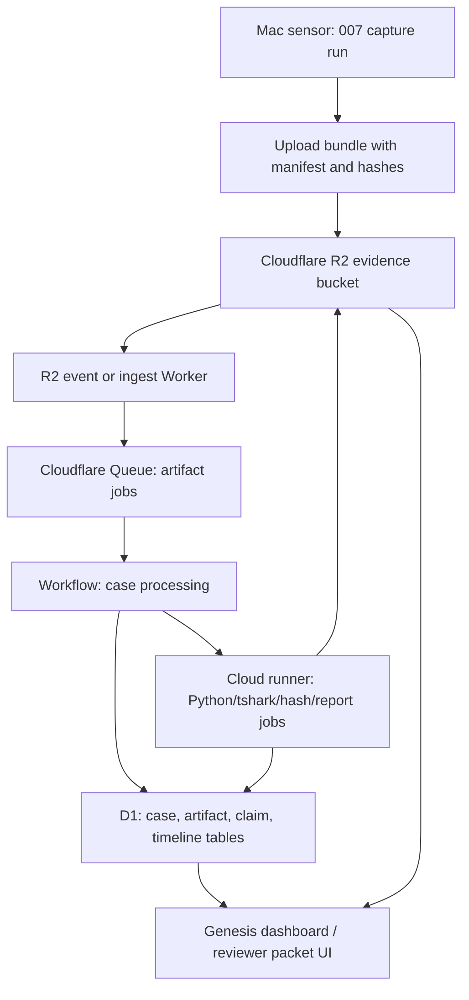

# 007 Cloud Evidence Orchestrator Plan

## Purpose

Move the long-running evidence review loop off the MacBook battery path without
pretending the cloud can replace macOS-only capture.

The Mac remains the sensor for local-only evidence:

- TCC databases and `tccd` logs
- Preboot, Recovery, Cryptex, APFS, and SSV state
- live app launches and process trees
- local filesystem provenance
- iPhone backup acquisition

The cloud becomes the durable processing and review layer:

- evidence intake
- hash verification
- manifest comparison
- URL/MDM probe normalization
- PCAP summarization
- claim matrix updates
- timeline stitching
- report package generation
- status notifications

## Recommended Shape

Use Cloudflare as the control plane and evidence lake:

- R2: immutable evidence object storage
- D1: normalized SQLite-style case database
- Queues: async job fanout for each uploaded artifact
- Workflows: durable multi-step case processing
- Durable Objects: per-case run state and lock coordination
- Pages or Worker UI: Genesis-style dashboard and reviewer packet browser
- Workers AI or external LLM: optional narrative draft, never primary proof

Use an external cloud runner for heavyweight work:

- GitHub Actions runner, small Linux VM, or future container lane
- pulls jobs from Queue or Worker API
- runs Python, `tshark`, `sqlite3`, hash checks, archive extraction, and report build
- writes derived outputs back to R2 and D1

Cloudflare Workers should coordinate and normalize. They should not be the only
place doing multi-gigabyte forensic parsing.

## Architecture



## Evidence Flow

### 1. Capture Locally

Run 007 locally as we do now. The output folder remains the legal source for the
local acquisition.

Required local outputs before upload:

- `chain_of_custody.csv`
- `evidence_hashes.csv` or SHA-256 manifest
- `command_log.md`
- `run_status.json`
- `timeline_events.tsv`
- `claim_matrix.tsv` when present
- raw evidence directories
- derived analysis directories

### 2. Seal The Upload

Create one cloud upload bundle per run:

```text
007_cloud_upload_<run_id>/
  manifest/
    chain_of_custody.csv
    evidence_hashes.csv
    upload_manifest.json
    command_log.md
  raw/
  derived/
  reports/
```

Upload rule:

- raw evidence is write-once
- derived outputs may be replaced only under a new run/job ID
- every object key includes case ID, run ID, artifact ID, and source hash

### 3. R2 Stores The Evidence

Suggested R2 key shape:

```text
cases/<case_id>/runs/<run_id>/raw/<artifact_id>/<filename>
cases/<case_id>/runs/<run_id>/derived/<job_id>/<filename>
cases/<case_id>/runs/<run_id>/reports/<packet_id>/<filename>
```

Do not make the bucket public. Access should be private through signed URLs or
authenticated Workers.

### 4. Queue Creates Work

Every upload produces jobs:

- `HASH_VERIFY`
- `FILE_TYPE_CLASSIFY`
- `MDM_URL_NORMALIZE`
- `PCAP_SUMMARIZE`
- `PARENT_CHILD_TRUST_CONTRAST`
- `TIMELINE_INGEST`
- `CLAIM_MATRIX_UPDATE`
- `REPORT_DRAFT`

Each job records:

- input object key
- input SHA-256
- parser version
- source case/run/artifact IDs
- output object key
- output SHA-256
- status and errors

### 5. D1 Keeps The Human-Readable Database

Start with the existing 007 schema model, but split storage:

- large files stay in R2
- normalized rows go to D1
- graph edges can either stay in D1 or be exported to a graph view later

Minimum D1 tables:

- `cases`
- `runs`
- `artifacts`
- `artifact_hashes`
- `jobs`
- `observations`
- `claims`
- `claim_evidence`
- `timeline_events`
- `network_observations`
- `mdm_enrollment_observations`
- `trust_boundary_observations`
- `reports`

### 6. Cloud Runner Handles Heavy Jobs

Use a Linux runner for jobs Cloudflare should not do directly:

- large archive extraction
- multi-GB hashing if not already done locally
- PCAP/tshark processing
- SQLite rebuilds
- PDF/DOCX rendering
- full recursive verification over uploaded file trees

Runner pattern:

```text
poll queue -> download R2 object -> verify hash -> process -> upload derived output -> update D1
```

The runner should be disposable. The evidence stays in R2 and D1.

## What Moves To Cloud Now

Move these first:

- MDM/AXM URL probe matrix
- MIME/type inspections
- parent-child trust contrast outputs
- PCAP summaries
- code verification TSV summaries
- claim matrix
- timeline narrator inputs
- report packet generation

Keep these local-only unless intentionally uploaded:

- raw TCC database copies
- keychain material
- full iPhone backup material
- live user home sensitive files
- any `.env`, token, PAT, credential, or password file

## Security Rules

- Never upload `.env`.
- Never upload PAT tokens or API keys.
- Encrypt sensitive bundles before upload when possible.
- R2 bucket is private.
- Use short-lived signed URLs for downloads.
- Use separate buckets for raw evidence and public/demo artifacts.
- Keep `source_hash`, `upload_hash`, and `derived_hash`.
- Treat cloud output as derived evidence, not the original acquisition.

## Cloudflare Product Fit

- Workers: intake API, signed URL minting, lightweight parsing, status endpoints.
- R2: evidence object lake for large artifacts.
- D1: normalized 007 database and claim matrix.
- Queues: fanout and retry jobs.
- Workflows: durable multi-step orchestration and human approval pauses.
- Durable Objects: per-case locking and live status.
- Pages: Genesis UI and packet browser.

## Pulseway / RMM Fit

Pulseway-style tooling should not become the evidence database. It can be useful
only as an operations layer:

- keep a cloud VM runner alive
- alert when runner is down
- restart a failed worker service
- report disk/CPU/memory

Do not use RMM tooling as the primary chain-of-custody surface.

## First Implementation Pass

### Phase 1: Cloud Packager

Add a local script:

```text
scripts/cloud/package_007_run.py
```

Inputs:

- run directory
- case ID
- output bundle directory

Outputs:

- upload manifest
- object-key manifest
- SHA-256 manifest
- redaction/exclusion report

### Phase 2: Cloudflare Worker Scaffold

Create:

```text
cloudflare/007-cloud-orchestrator/
  wrangler.toml
  src/index.ts
  schema/d1.sql
  README.md
```

Endpoints:

- `POST /cases`
- `POST /runs`
- `POST /uploads/presign`
- `POST /artifacts/complete`
- `GET /runs/:id/status`
- `GET /claims/:case_id`

### Phase 3: D1 Schema Mirror

Map the existing `database/007_core_schema.sql`,
`database/007_graph_schema.sql`, and `database/007_outputs_schema.sql` into a
cloud-safe D1 subset.

### Phase 4: Queue And Runner

Create a runner:

```text
cloud-runner/007_worker.py
```

It pulls jobs, downloads artifacts, processes them with existing 007 scripts,
uploads derived outputs, and updates D1.

### Phase 5: Genesis Front End

Genesis reads D1 and R2 through the Worker:

- Evidence Browser
- Claim Matrix
- Reverse Hypothesis Map
- Timeline Narrator
- Packet Builder

## What This Solves

- MacBook can die without losing review progress.
- Uploads become resumable evidence packets.
- Long-running parsing can happen on cloud infrastructure.
- 007 becomes the private backend security database.
- Genesis becomes the readable product layer.
- Hydrate can upload mobile/iOS-derived artifacts into the same case model.

## What This Does Not Solve Alone

- It cannot collect live TCC, Preboot, or app launch behavior without the Mac.
- It cannot prove claims without source artifacts.
- It cannot replace local chain-of-custody.
- It cannot safely execute suspicious macOS apps in Cloudflare.

## Go / No-Go Gate

Go when:

- current 007 run has a stable manifest
- `.env` and secrets are excluded
- R2 bucket and D1 database are private
- one small test bundle uploads and verifies cleanly
- one derived job writes back to D1 and R2

No-go when:

- raw secrets are still in the bundle
- source hashes are missing
- upload paths are not deterministic
- cloud output cannot be traced back to local source artifacts

## Best First Test

Use the MDM enrollment bridge branch because it is small and structured.

Upload:

- `mdm_enrollment_bridge_ingest_20260629T225325Z`
- its `source_manifest.tsv`
- `mdm_url_probe_matrix.tsv`
- `claim_matrix.tsv`
- `domain_identity_matrix.tsv`

Then prove the cloud can:

1. verify hashes
2. ingest rows into D1
3. render the claim matrix
4. generate a reviewer-safe summary
5. preserve links back to raw source paths and hashes

That gives us a safe cloud smoke test before uploading giant PCAPs or Cryptex
material.
